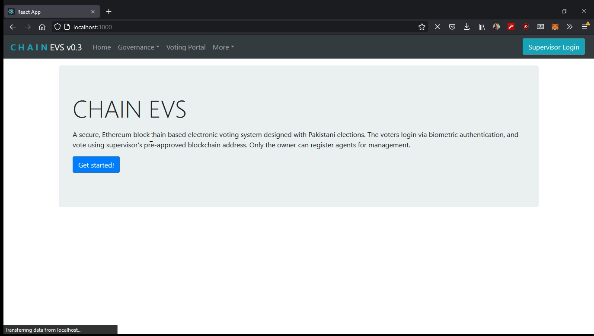
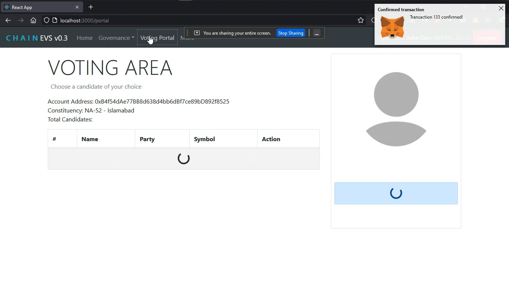
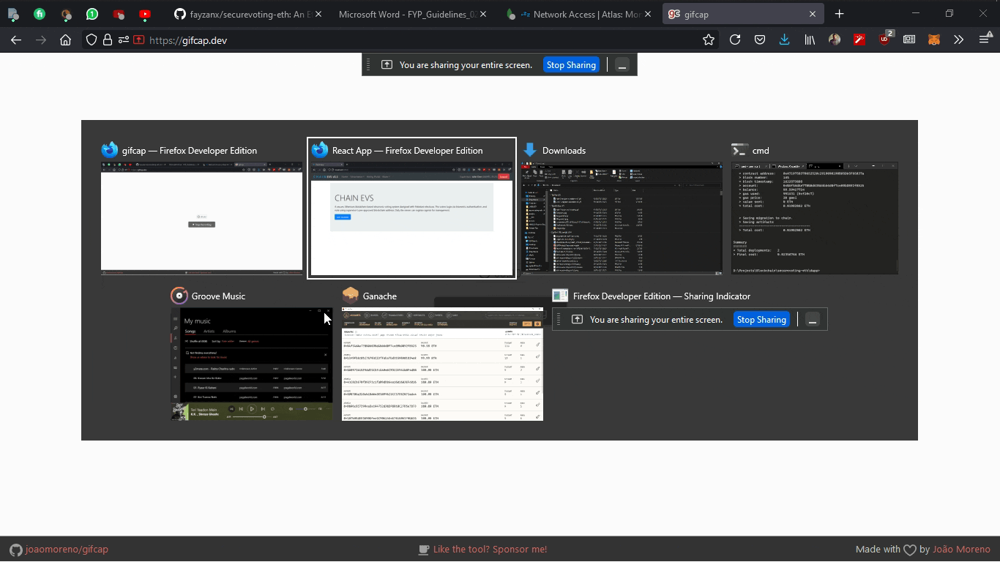
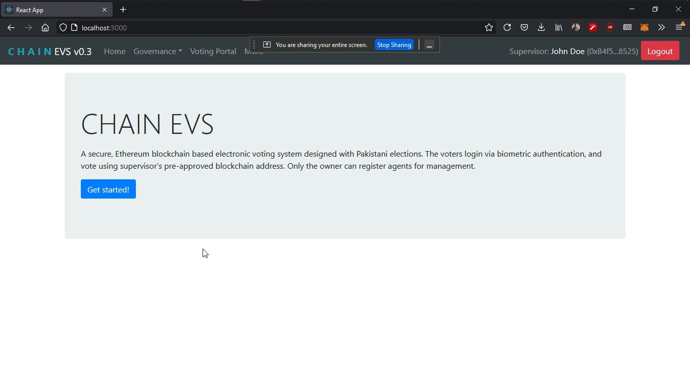
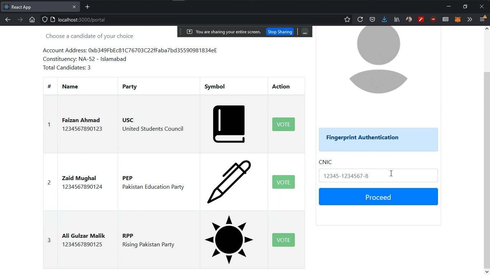
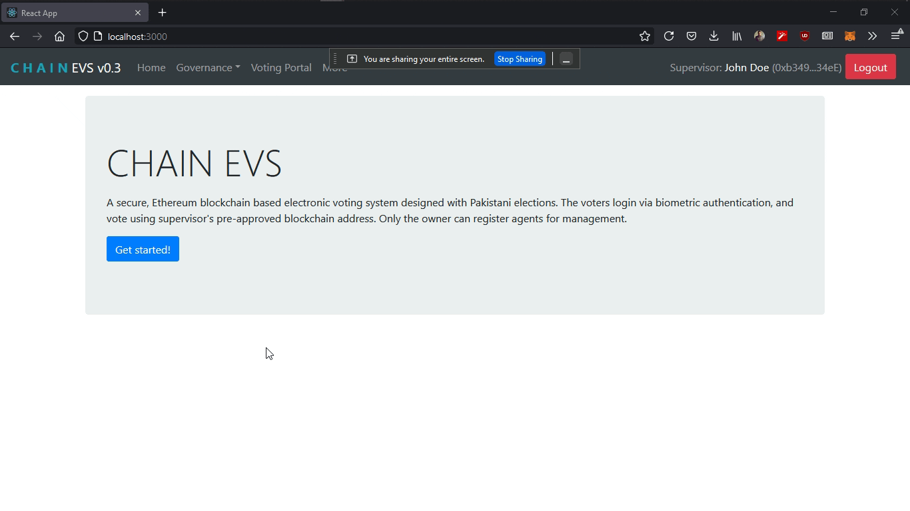

# securevoting-eth: Secure Electronic Voting System

An Ethereum Blockchain based Secure Voting Application for use in Pakistan's Electrocal Process.

## Demo

A simple working of the application (the software part) is shown here. For hardware part, video can be provided on request. Only main gifs are shown, rest can be seen in the `/screens` folder.

### 1. Login and Loading of Data


### 2. Governance: Register Candidate


### 3. Governance: Register Voter


### 4. Governance: Register Supervisor


### 5. Voter: Cast Vote


### 6. Governance: View Results



## Development

### Pre-requisites

1. Install Node.js.
2. Install `yarn` package manager
    ```bash
    npm install -g yarn
    ```
3. Clone the repository
    ```bash
    git clone https://github.com/fayzanx/securevoting-eth.git
    cd securevoting-eth
    ```

### Ethereum DApp and Frontend
1. Install dependencies 
    ```bash
    cd dapp
    yarn
    ```

2. Start the front-end development server
    ```bash
    yarn start
    ```

3. Start ethereum blockchain development mode
    ```bash
    truffle compile
    truffle develop
    ```

### Express Server
1. Install dependencies 
    ```bash
    cd server
    yarn
    ```

2. Rename the ```.env.example``` file to ```.env``` and edit the environment variables
    ```
    PORT = //add port number here
    CONNECTION_URL = "MONGO DATABASE URL"
    ```

2. Start the server
    ```bash
    yarn start
    ```


## Procedure

### Authorization Levels

* `AL-1` Election Management Level (Contract Owner)
* `AL-2` Polling Booth Management Level (Agent)

### Proposed flow

1. AL-1 will register candidates constituency wise and start election window
2. An AL-2 person will unlock the machine and the app with their sign in info, ethereum wallet (MetaMask)
3. The AL-2 person will then start the voting process by navigating to ```/portal```
4. The voter will now enter CNIC, verify via biometric and vote the desired candidate
5. AL-2 will end the voting process for the booth (not implemented)
6. AL-1 will generate results by navigating to ```/manage/results```